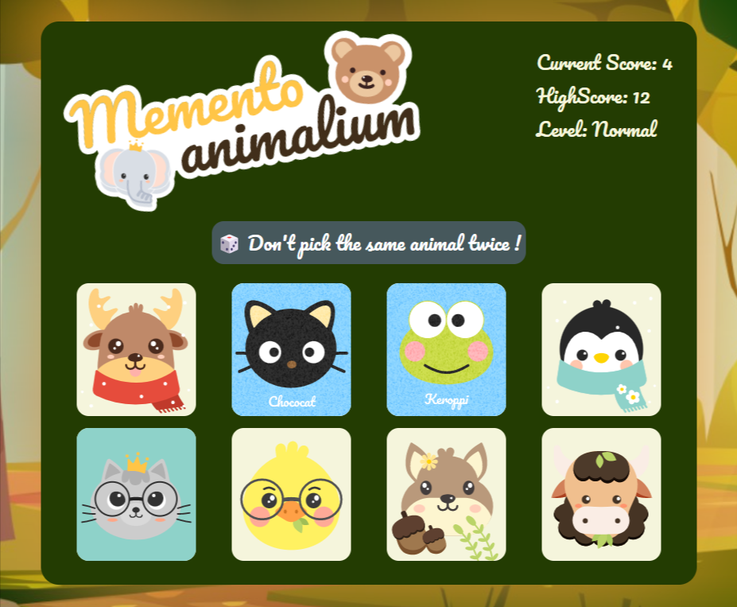

# React Memory game

The project is to build a game of memory in React.
The goal is to pick all the cards but only once !
When you succeed, you get a new more difficult level.

🔗 **Live preview:** [here](https://luxury-kleicha-56f767.netlify.app/)

### Screenshot

## Built with

### Technologies

- HTML
- CSS
- React JS
- Figma

### Tools

- Vite
- Framer motion (react animations)

## Features

- game of card memory, you keep picking cards until you lose if you pick one you have already picked before.
- score and highscore kept in localstorage
- responsive design

## What I learned

- Better knowledge of **React** use of useState.

## Author

👤 **Edouard Desgrée**

- GitHub: [edesgree](https://github.com/edesgree)

#### Created while working on the [The Odin Project](https://www.theodinproject.com/)
